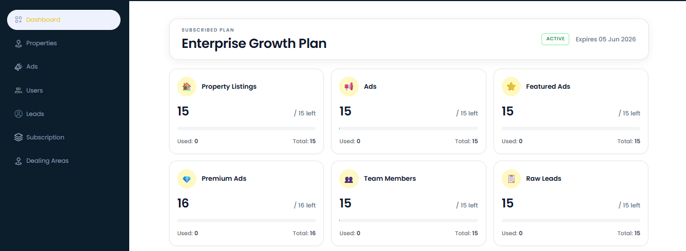
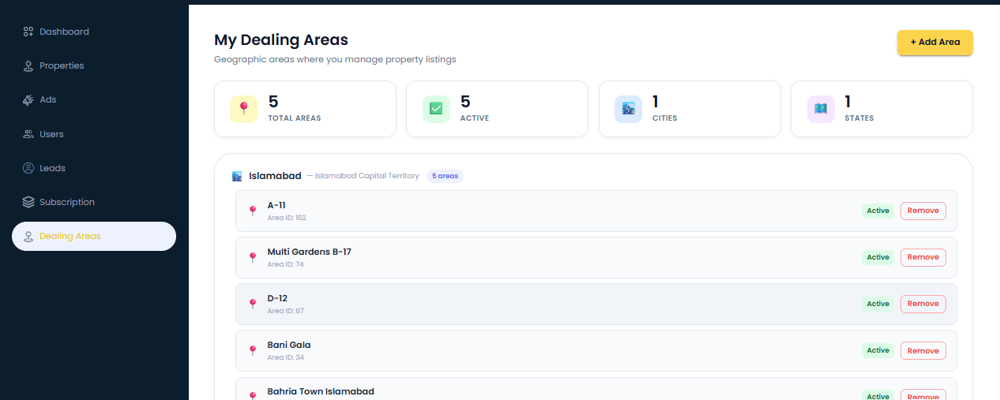
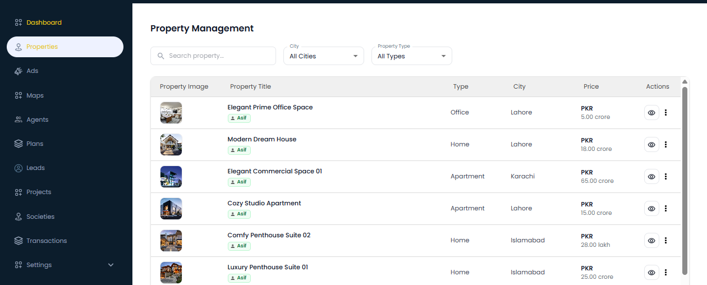
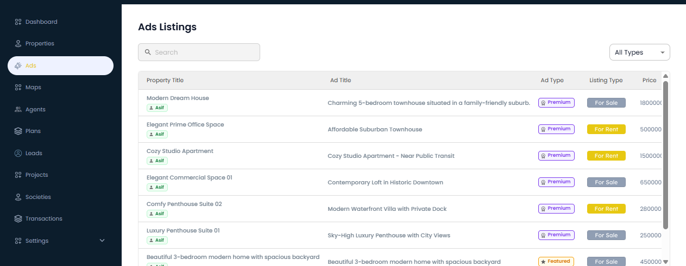
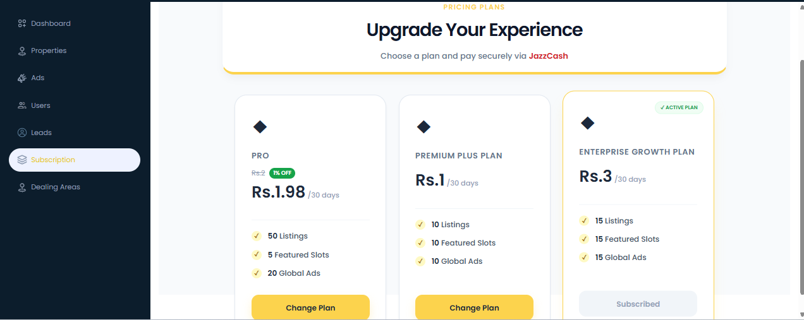
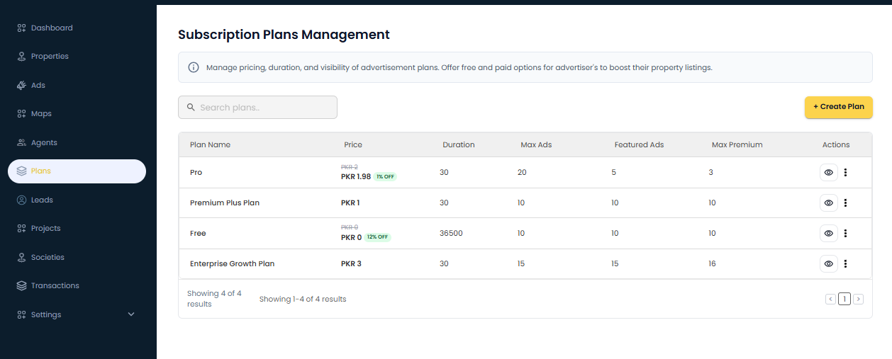

# Real Estate Explorer

> A high-performance, map-first real estate ecosystem engineered with Next.js 16 and Tailwind CSS 4, delivering a seamless, enterprise-grade property discovery and management experience.

  

  <a href="#overview">Overview</a> •
  <a href="#admin-portal">Admin Portal</a> •
  <a href="#assets">Assets</a> •
  <a href="#architectural-highlights">Highlights</a> •
  <a href="#tech-stack">Tech Stack</a> •
  <a href="#author">Author</a>

---

## Table of Contents

- [Overview](#overview)
- [Admin Portal](#admin-portal)
- [Assets](#assets)
- [Architectural Highlights](#architectural-highlights)
- [Tech Stack](#tech-stack)
- [Author](#author)

---

## Overview

Real Estate Explorer is a cutting-edge property marketplace architecture. It bridges the gap between traditional property listings and next-gen geospatial discovery — empowering users with real-time interactivity and data-driven insights directly on a live map.

Built with a highly scalable Next.js App Router architecture communicating with a high-concurrency Go (Gin) backend, it features:

- ### AI-Powered Insights
  - **Intelligent Recommendations**: Machine learning algorithms that suggest properties based on user behavior and preferences.
  - **Smart Market Analysis**: Real-time property valuation and trends prediction using historical data points.
  - **Automated Lead Scoring**: Predictive analysis to prioritize high-intent leads for agents.

- Immersive Geospatial Interface: Interactive map powered by Leaflet with optimized WMS society layer overlays.
- Intelligent Property Mapping: Advanced pin clustering and dynamic color-coded markers for enhanced UX.
- Enterprise Onboarding: Streamlined, multi-step agent and agency verification flows.
- State-of-the-Art Security: JWT-based authentication with highly secure, persistent session management.
- Pixel-Perfect Responsiveness: Adaptive UI with fluid layouts and high-performance skeleton loading states.

> Note: This is a proprietary, company-confidential project built for a private client. Source code and deployment are for internal use only.

---

## Admin Portal

The Admin Portal is an enterprise-grade web interface used to operate the entire PlotsMap platform. It provides role-based access to manage complex data lifecycles and platform configurations.

### Key Management Modules

- **User & Permissions**: Advanced administration of system users, agents, and customers with granular RBAC and permission gating.
- **AI Analytics & Insights**: Integrated reporting tools for monitoring platform growth and user engagement trends.
- **Lead Lifecycle Management**: Intelligent tracking from acquisition to conversion with automated agent assignment.
- **Monetization Engine**: Integrated subscription plans with automated billing and **JazzCash** payment integration.
- **Agent Ecosystem**: Comprehensive management of agents and sub-agent hierarchies with drill-down capabilities.
- **Property & Ad Operations**: Map-based ad placement, marker layer controls, and property detail management with map picker integration.
- **Financial Systems**: Full transaction auditing, plan management, and subscription lifecycle tracking.
- **Geospatial & Project Management**: Administration of housing societies, infrastructure projects, location parameters, and interested areas.
- **Centralized Settings**: Global configuration for system users, customer profiles, and geographic location mapping.

---

## Assets

> Add your images to the `assets/` folder in the project root and they will render automatically below.

---

### Hero / Home Page

  

> Landing page with search bar, featured properties, map call-to-action, and advertisement banners.

---

### Interactive Map

  

> Full-screen Leaflet map with property pins, WMS society overlays, base map switcher (street/satellite/terrain), and measurement tools.

---

### Map Filters

  

> Filter panel on the map allowing users to narrow down visible property pins by type, city, and intent (buy/rent).

---

### Property Listings

  

> Browse all properties with filters for city, type (residential/commercial), price range, and buy/rent intent.

---

### Property Detail

  

> Full property detail page including image gallery, description, map location, pricing, and agent contact info.

---

### Premium Properties

  

> Dedicated page showcasing highlighted and featured premium property ads.

---

### Agents Directory

  

> Browse all agents and agencies with top-rated spotlights, new agency highlights, and city-based filtering.

---

### Agency Profile

  

> Individual agent/agency profile page with their listed properties, contact info, and staff carousel.

---

### Societies

  

> Browse housing societies with city-based filtering and individual society detail pages with map integration.

---

### Login

  

> Secure login page with email/password authentication and JWT session management.

---

### Signup Flow

  

> Registration flow for individual users and agents, including the two-step agency onboarding with company details.

---

### Agent Dashboard

  

> Enterprise analytics dashboard providing real-time oversight of platform metrics, user activities, and financial performance.

---

### Leads Management

  

> Advanced lead tracking system with role-based assignment workflows and conversion analytics.

---

### Property Operations

  

> Centralized property management hub for auditing listings, approving advertisements, and map-based placement controls.

---

### Ad Management & Visualization

  

> Specialized interface for managing premium ad placements, configuring map-based visibility, and tracking advertisement performance.

---

### Plans & Subscriptions

  

> Management interface for subscription tiers, localized payment processing, and user plan lifecycle tracking.

---

### Plan Configuration

  

> Administrative tools for defining service plans, feature sets, and monetization parameters.

## Architectural Highlights

### High-Performance Go Backend
The backend is engineered using **Go** and the **Gin Gonic** framework, chosen for its ultra-low latency and efficient handling of high-concurrency requests. It serves as a robust RESTful gateway, orchestrating data flow between the interactive frontend and the geospatial database.

### Advanced Geospatial Engine
Leveraging **Leaflet.js** and **React-Leaflet**, the platform provides an immersive map experience. It features custom-built society layer toggles using **WMS (Web Map Service)** overlays, allowing users to visualize complex housing society boundaries with precision.

### Enterprise-Grade Security & Role-Based Access
Authentication is architected using **JWT (JSON Web Tokens)** with a sophisticated **Role-Based Access Control (RBAC)** system. The platform distinguishes between multiple user personas—including **Super Admins**, **Agencies**, **Individual Agents**, **Sub-agents**, and **End-Customers**—each with granular permission sets. Secure, HTTP-only cookie management ensures sessions remain protected while providing a seamless, persistent user experience.

### Advanced Fintech Integration
The ecosystem features a robust subscription-based monetization model with a variety of plan tiers. It includes a custom-built payment gateway integration for **JazzCash**, enabling seamless, secure, and localized transaction processing for plan upgrades and featured ad placements.

### Modern Component Architecture
Built with **Next.js 16 (App Router)** and **Tailwind CSS 4**, the frontend follows an atomic design pattern. By utilizing **Tailwind CSS 4** for utility-first styling and **Material UI (MUI)** for complex components, the platform achieves a pixel-perfect, highly maintainable, and responsive interface.

---

## Tech Stack

| Category | Technology |
|---|---|
| Framework | Next.js 16.1.4 (App Router) |
| Backend | Go (Gin) RESTful API |
| Payment Gateway | JazzCash Integration |
| Deployment | Docker, PM2 |
| CI/CD | GitHub Actions Pipelines |
| Admin Stack | Next.js, Zustand, Recharts, React Quill |
| UI Library | React 19.2.3, Material UI (MUI) |
| Language | TypeScript 5 |
| Styling | Tailwind CSS 4.1.18 |
| Component Library | Material UI (MUI) 7.3.6 |
| Maps | Leaflet 1.9.4 + React-Leaflet 5.0.0 |
| Map Measure Tool | react-leaflet-measure 3.0.1 |
| HTTP Client | Axios 1.13.2 |
| Auth / Cookies | cookies-next 6.1.0 |
| Notifications | react-toastify 11.0.5 |
| Skeleton Loaders | react-loading-skeleton 3.5.0 |
| Icons | Lucide React 0.561.0 + react-icons 5.5.0 |
| Containerization | Docker (Node 20 Alpine) |

---

## Author

**Ahmad Bahar**
- GitHub: [@Ahmadbahar11](https://github.com/Ahmadbahar11)
- Email: ahmadbahar480@gmail.com

---

> This is a confidential project built for a private client. Unauthorized distribution is not permitted.
