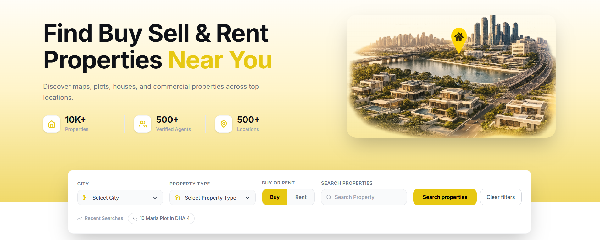
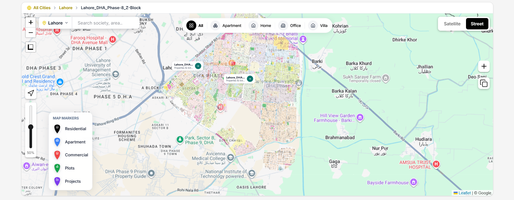
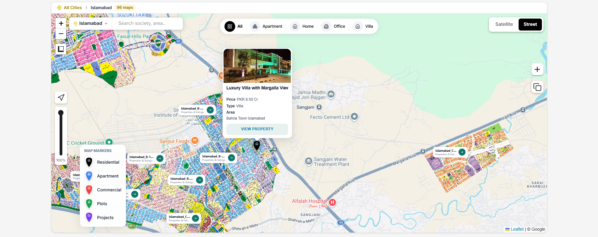
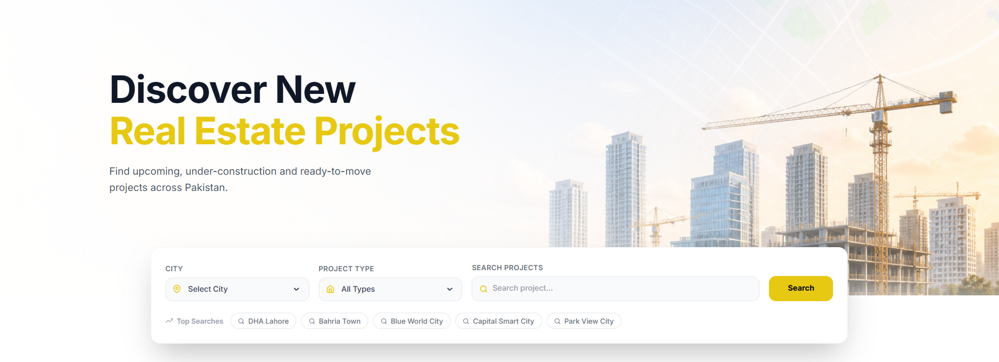
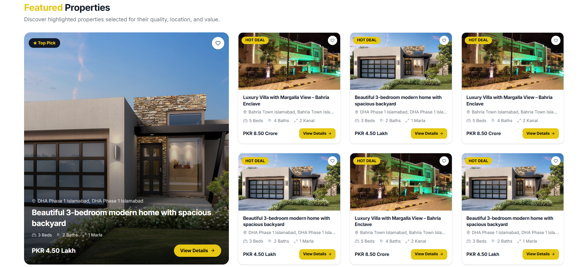
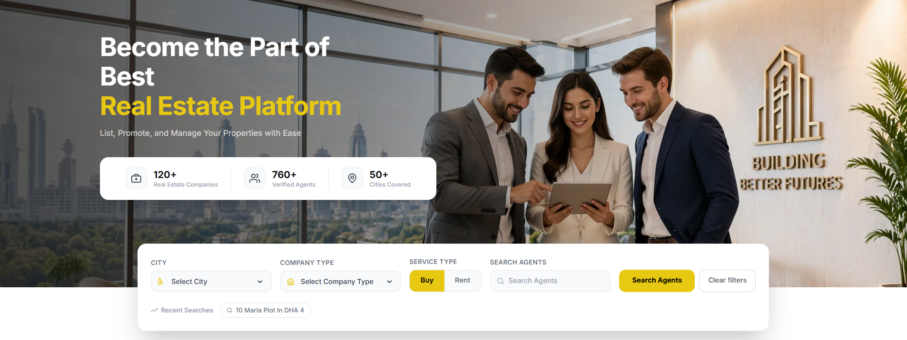
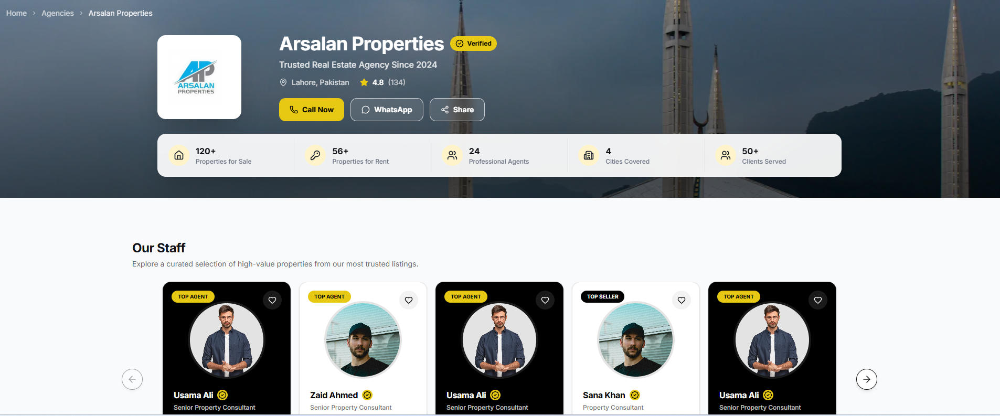
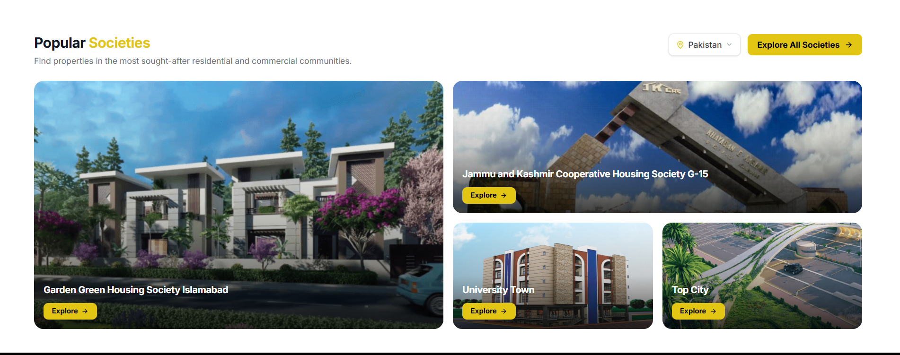
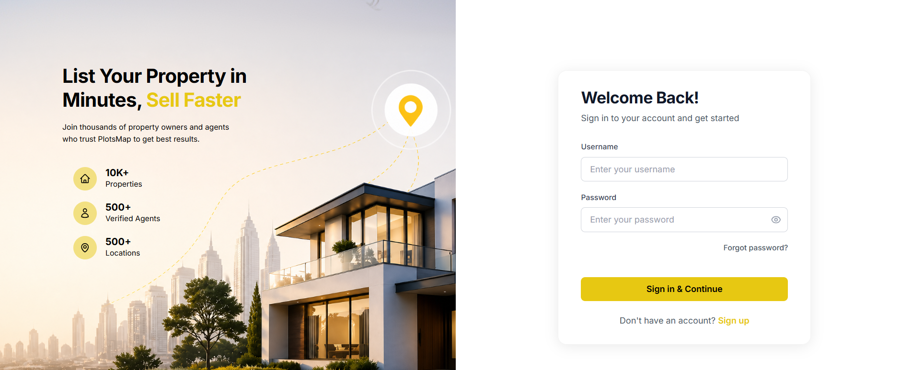

# Real Estate Explorer

> A **high-performance**, map-first real estate ecosystem engineered with **Next.js 16** and **Tailwind CSS 4**, delivering a seamless, **enterprise-grade** property discovery experience.

  

  <a href="#overview">Overview</a> •
  <a href="#assets">Assets</a> •
  <a href="#architectural-highlights">Highlights</a> •
  <a href="#tech-stack">Tech Stack</a> •
  <a href="#author">Author</a>

---

## Table of Contents

- [Overview](#overview)
- [Assets](#assets)
- [Architectural Highlights](#architectural-highlights)
- [Tech Stack](#tech-stack)
- [Author](#author)

---

## Overview

**Real Estate Explorer** is a **cutting-edge** property marketplace architecture. It bridges the gap between traditional property listings and **next-gen geospatial discovery** — empowering users with **real-time interactivity** and **data-driven** insights directly on a live map.

Built with a **highly scalable** Next.js App Router architecture communicating with a **high-concurrency Go (Gin)** backend, it features:

- **Immersive Geospatial Interface**: Interactive map powered by Leaflet with optimized WMS society layer overlays.
- **Intelligent Property Mapping**: Advanced pin clustering and dynamic color-coded markers for enhanced UX.
- **Enterprise Onboarding**: Streamlined, multi-step agent and agency verification flows.
- **State-of-the-Art Security**: JWT-based authentication with **highly secure**, persistent session management.
- **Pixel-Perfect Responsiveness**: Adaptive UI with fluid layouts and high-performance skeleton loading states.

> **Note:** This is a proprietary, company-confidential project built for a private client. Source code and deployment are for internal use only.

### Who Is It For?

| User Type | What They Can Do |
|---|---|
| Buyers / Renters | Search and browse properties via map or list view, filter by city, type, and price |
| Agents & Agencies | Create a profile, list properties, and manage ads |
| Visitors | Explore societies, view property details, and contact agents |

---

## Assets

> Add your images to the `assets/` folder in the project root and they will render automatically below.

---

### Hero / Home Page

  

> Landing page with search bar, featured properties, map call-to-action, and advertisement banners.

---

### Interactive Map

  

> Full-screen Leaflet map with property pins, WMS society overlays, base map switcher (street/satellite/terrain), and measurement tools.

---

### Map Filters

  

> Filter panel on the map allowing users to narrow down visible property pins by type, city, and intent (buy/rent).

---

### Property Listings

  

> Browse all properties with filters for city, type (residential/commercial), price range, and buy/rent intent.

---

### Property Detail

  

> Full property detail page including image gallery, description, map location, pricing, and agent contact info.

---

### Premium Properties

  

> Dedicated page showcasing highlighted and featured premium property ads.

---

### Agents Directory

  

> Browse all agents and agencies with top-rated spotlights, new agency highlights, and city-based filtering.

---

### Agency Profile

  

> Individual agent/agency profile page with their listed properties, contact info, and staff carousel.

---

### Societies

  

> Browse housing societies with city-based filtering and individual society detail pages with map integration.

---

### Login

  

> Secure login page with email/password authentication and JWT session management.

---

### Signup Flow

  

> Registration flow for individual users and agents, including the two-step agency onboarding with company details.

## Architectural Highlights

### High-Performance Go Backend
The backend is engineered using **Go** and the **Gin Gonic** framework, chosen for its ultra-low latency and efficient handling of high-concurrency requests. It serves as a robust RESTful gateway, orchestrating data flow between the interactive frontend and the geospatial database.

### Advanced Geospatial Engine
Leveraging **Leaflet.js** and **React-Leaflet**, the platform provides an immersive map experience. It features custom-built society layer toggles using **WMS (Web Map Service)** overlays, allowing users to visualize complex housing society boundaries with precision.

### Enterprise-Grade Security
Authentication is handled via **JWT (JSON Web Tokens)** with a focus on security and persistent UX. Secure, HTTP-only cookie management ensures sessions remain protected while providing a seamless user experience across browser restarts.

### Modern Component Architecture
Built with **Next.js 16 (App Router)** and **Tailwind CSS 4**, the frontend follows an atomic design pattern. By utilizing **Material UI (MUI)** for complex components and **Lucide** for intuitive iconography, the platform achieves a pixel-perfect, responsive interface.

---

## Tech Stack

| Category | Technology |
|---|---|
| Framework | Next.js 16.1.4 (App Router) |
| Backend | Go (Gin) RESTful API |
| UI Library | React 19.2.3 |
| Language | TypeScript 5 |
| Styling | Tailwind CSS 4.1.18 |
| Component Library | Material UI (MUI) 7.3.6 |
| Maps | Leaflet 1.9.4 + React-Leaflet 5.0.0 |
| Map Measure Tool | react-leaflet-measure 3.0.1 |
| HTTP Client | Axios 1.13.2 |
| Auth / Cookies | cookies-next 6.1.0 |
| Notifications | react-toastify 11.0.5 |
| Skeleton Loaders | react-loading-skeleton 3.5.0 |
| Icons | Lucide React 0.561.0 + react-icons 5.5.0 |
| Containerization | Docker (Node 20 Alpine) |

---

## Author

**Ahmad Bahar**
- GitHub: [@Ahmadbahar11](https://github.com/Ahmadbahar11)
- Email: ahmadbahar480@gmail.com

---

> 🔒 This is a confidential project built for a private client. Unauthorized distribution is not permitted.
